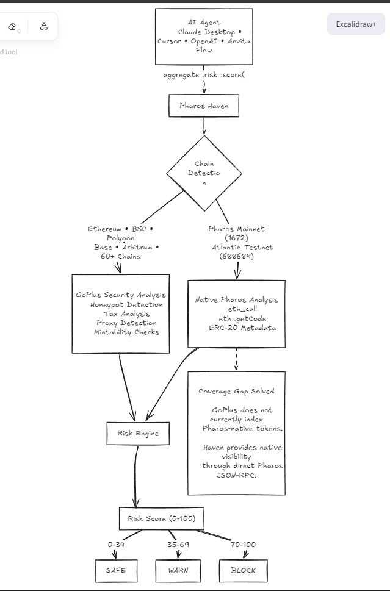
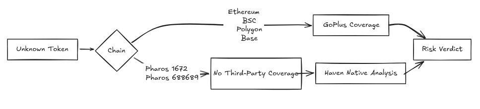

# Pharos Haven 

> **Pharos Haven — the missing safety layer for the Pharos AI Agent economy.** Every future agent can call Haven before touching an unknown token. Haven combines GoPlus's 60-chain breadth with native Pharos JSON-RPC, so an agent gets one verdict whether the token lives on Ethereum or on the chain it's actually deployed to.

### Why this matters now

Pharos mainnet is six weeks old. The Pharos AI Carnival will push 150,000 PROS of incentives toward agents that move value on-chain. Every one of those agents will encounter a Pharos-native ERC-20 with zero third-party security coverage. Haven is the vetting layer that ships before that wave arrives, not after the first rug.

## Architecture



### Token Verification Flow



## Quickstart (30 seconds)

```bash
# After publish (recommended)
npx pharos-haven

# From source (clone + run)
git clone https://github.com/Anand-0037/pharos-haven.git
cd pharos-haven && npm install && npm run dev
```

> Native Pharos support: chain ID **1672** (Pacific Ocean mainnet, RPC `rpc.pharos.xyz`) and **688689** (Atlantic testnet, RPC `atlantic.dplabs-internal.com`). No other Skill in this hackathon reads Pharos-native ERC-20 metadata via JSON-RPC.

Or add to Claude Desktop config: see `examples/claude-desktop-config.json`.

> **Demo video:** [YouTube link to be filled before submission]

## Why this exists

In April 2026, a wallet of mine was drained for ~$600 after I approved what looked like a routine ERC-20 — the contract had a hidden honeypot the explorer never surfaced. Pharos AI agents will hit the same rug at machine speed, autonomously signing thousands of approvals a day with no human in the loop. Haven is the read-only second opinion every agent runs before it touches an unknown token — free, dual-mode, 200 ms.

## What it does (4 tools)

- **check_token_goplus**: honeypot, taxes, mintable, proxy on 60+ EVM chains (GoPlus API).
- **check_token_pharos_native**: ERC-20 metadata + deployment via Pharos JSON-RPC on chains 1672 and 688689.
- **aggregate_risk_score**: 0–100 score + safe/warn/block decision. Single entry point.
- **explain_risk_verdict**: natural language explanation + actionable AI agent recommendations. Dual-mode.

**Pharos coverage.** Chains **1672** (Pacific Ocean mainnet) + **688689** (Atlantic testnet) via direct JSON-RPC. Method selectors: `name() 0x06fdde03`, `symbol() 0x95d89b41`, `decimals() 0x313ce567`, plus `eth_getCode`.

**Composability example:** see `examples/agent-loop.ts` — a 25-line safe-swap agent that calls `aggregate_risk_score` before any approval and routes on `safe` / `warn` / `block`.

## How it stays $0

Read-only. No wallet. No gas. Free GoPlus API + free public Pharos RPC.

## Tests

```bash
bash tests/smoke.sh
```

Runs 5 smokes end-to-end against live GoPlus + live Pharos RPC:

1. USDT (ETH chain 1) via GoPlus → `safe`
2. ChainLink LINK (Pharos 1672) via native RPC → `warn` with metadata
3. CAKE (BSC 56) via GoPlus → `safe`
4. Same Pharos LINK queried through GoPlus → `unknown` (proves GoPlus gap)
5. Same Pharos LINK through `aggregate_risk_score` → `warn` (proves Haven covers the gap)

Smokes 4 and 5 are the dual-mode proof: GoPlus blind, Haven sees.

## Phase 2 roadmap

**SafeSwap Agent on Anvita Flow** — an autonomous Agent B (per Anvita's 4-actor model) that uses Haven to vet every token it sees, refuses unsafe approvals, and earns reputation per successful safe-swap. Future tools: `check_address_blacklist`, `bridge_risk_assessment`, `safe_swap_advisor`.

## Built for the Pharos ecosystem

- **Pharos Network.** Native ERC-20 vetting via JSON-RPC on chains 1672 and 688689. Closes a coverage gap no other Skill in this hackathon addresses.
- **GoPlus Security (sponsor).** Haven consumes `token_security` today. Phase 2 contributes back: a community-submitted Pharos honeypot signature feed that GoPlus can ingest as a data partner, extending GoPlus coverage to chain 1672 before they index it natively.
- **CertiK (sponsor).** Phase 2 adds a `check_certik_audit` tool that queries Skynet alongside GoPlus, giving agents one verdict from two independent security graphs.
- **Anvita Flow.** Haven follows the same Skill format Anvita's own `early-access-onboarding` Skill uses. The Phase 2 SafeSwap Agent (see roadmap) is built as Agent B in Anvita's 4-actor economic model — a service agent that earns reputation per successful safe-swap and settles in PROS via x402.
- **Pharos AI Carnival.** Haven is built to plug into the 150,000 PROS Carnival pipeline as the default token-safety layer for every Carnival agent.

## License

MIT-0 — see LICENSE.
